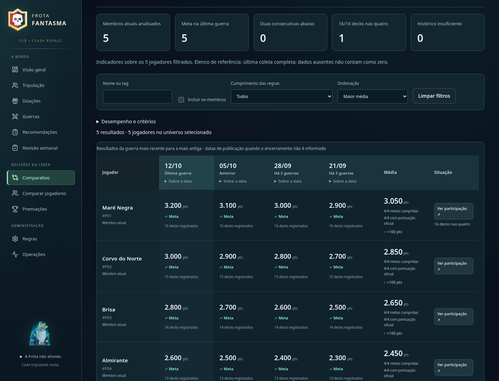
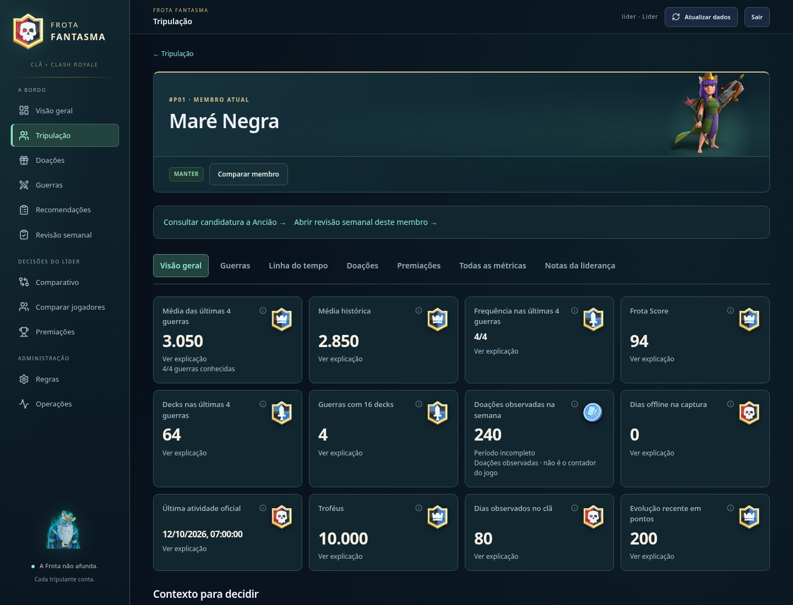

# Frota Fantasma Analytics

### Gestão e acompanhamento do clã

**Compare as últimas quatro guerras, acompanhe as doações e confira os critérios para promover ou revisar cada membro.**

Clash Royale · Frota Fantasma · **#RQJGC9GV**

[Recursos](#recursos) · [Telas do sistema](#telas-do-sistema) · [Guia de execução](docs/GUIA-DE-EXECUCAO.md)

---

## Sobre o projeto

O **Frota Fantasma Analytics** reúne resultados de guerras, doações, atividade
e histórico dos membros do clã **#RQJGC9GV**, no Clash Royale.
A liderança pode comparar desempenho, consultar critérios de promoção e
registrar avaliações e justificativas.

Promoções e expulsões dependem da decisão do líder. O sistema não executa
nenhuma dessas ações no jogo.

## Recursos

| Área | Como ajuda a liderança |
| --- | --- |
| **Visão geral** | Consulte os indicadores da semana, as pendências e a evolução do clã. |
| **Membros e perfis** | Consulte guerras, doações, atividade, cargos e anotações de cada membro. |
| **Guerras** | Consulte a corrida atual e resultados anteriores, com pontos, decks utilizados e participação registrada. |
| **Comparativo de guerras** | Compare as últimas quatro guerras em uma tabela, filtre participação e consulte evidências sem transformar lacunas em faltas. |
| **Comparar jogadores** | Veja membros lado a lado e compare desempenho no mesmo contexto histórico. |
| **Candidatos a Ancião** | Encontre candidatos ordenados, confira critérios atendidos e abra as evidências antes de decidir. |
| **Doações** | Consulte a semana atual e as cinco anteriores, preservando os números coletados mesmo após o reset do jogo. |
| **Premiações** | Acompanhe a projeção da semana e consulte o histórico dos títulos formalizados. |
| **Revisão semanal** | Organize os casos que precisam de avaliação, registre justificativas e acompanhe decisões pendentes. |

## Telas do sistema

As telas abaixo mostram os principais recursos de consulta e avaliação.

Capturas atualizadas da interface desktop, com nomes e dados fictícios. Clique para abrir em tamanho original.

### Resumo da semana

Consulte o número de membros, a média de pontos, a participação e as doações.
O painel também reúne candidatos a Ancião e casos que precisam de acompanhamento.

### Comparativo de guerras

Veja pontos e decks de cada membro lado a lado, compare médias e filtre o
cumprimento das metas. A tabela preserva a diferença entre resultado conhecido
e histórico insuficiente, para dar contexto a cada avaliação.

### Candidatos a Ancião

A área de candidatos a Ancião reúne prontidão, pendências e alertas.
Filtros e resumos individuais ajudam a escolher quem avaliar; os critérios e
as evidências continuam disponíveis antes de qualquer decisão.

<strong>Perfil do membro e detalhes dos indicadores</strong>

### Perfil do membro

O perfil reúne desempenho recente, participação, doações e atividade.
As abas dão acesso às guerras, à linha do tempo, às premiações e às notas da
liderança.

### Detalhes dos indicadores

Abra um indicador para consultar o cálculo, a origem, o período e a amostra.
Os registros utilizados ficam acessíveis na mesma janela, sem perder o lugar
na página.

## Premiações

As premiações seguem três categorias:

- **Capitão da Guerra:** destaque pela pontuação na guerra.
- **Guardião da Frota:** reconhecimento pelo maior contador de doações coletado na semana encerrada.
- **Alma Imortal:** consistência ao longo das guerras analisadas.

Os títulos seguem os critérios e a amostra disponíveis. A projeção é provisória;
o reconhecimento formalizado fica registrado. Um jogador não acumula títulos
na mesma semana, e categorias sem dados suficientes podem ficar sem vencedor.

## Revisão semanal

A **revisão semanal de expulsões** reúne os membros que precisam de atenção e
ajuda a organizar a avaliação individual. Na regra atual, são analisados casos
com menos de **1.600 pontos** ou mais de **cinco dias offline**, respeitando a
disponibilidade e a atualização dos dados.

O líder pode registrar uma decisão: **manter, conversar, dispensar ou aguardar
justificativa**. Cada registro conserva motivo, autor e histórico; avaliações
podem ser reabertas quando surgir novo contexto.

Avisos de ausência e justificativas ficam associados ao membro.
A decisão registrada no painel não remove ninguém do jogo.

## Histórico de guerras e doações

**Guerras.** Médias recentes, últimas quatro guerras e
tendências ajudam a distinguir consistência de um resultado isolado.

**Doações.** As capturas já realizadas permanecem salvas.
A consulta de seis semanas se renova automaticamente; sair dessa janela não apaga
o histórico armazenado. Os contadores e as doações observadas têm suas limitações
explicadas no painel.

**Recomendações.** Critérios, pendências e evidências ajudam
a entender por que um membro aparece como candidato ou merece acompanhamento.

## Fontes e limitações dos dados

- **Fonte oficial como base:** os dados da Supercell têm prioridade.
- **Números com explicação:** consulte período, origem e limitações das métricas.
- **Lacunas visíveis:** informação desconhecida não vira zero nem certeza artificial.
- **Contexto preservado:** notas da liderança, avaliações e decisões guardam histórico.
- **Acesso por perfil:** liderança e consulta têm permissões distintas; notas privadas ficam restritas.
- **Histórico complementar:** importações manuais de CSV do RoyaleAPI, nos formatos suportados, passam por análise, identificação e confirmação. Conflitos não sobrescrevem dados oficiais.

O histórico cresce enquanto a aplicação coleta dados. Informações anteriores que
não foram capturadas não são recuperadas apenas com o passar do tempo.

## Instalação e operação

Configuração, instalação e comandos estão no **[Guia de execução](docs/GUIA-DE-EXECUCAO.md)**.

| Assunto | Documentação |
| --- | --- |
| Instalar e executar a aplicação | [Guia de execução](docs/GUIA-DE-EXECUCAO.md) |
| Comparar quatro guerras e participação | [Comparativo de guerras](docs/COMPARATIVO.md) |
| Entender indicadores e critérios | [Métricas e análises](docs/ANALYTICS.md) |
| Conhecer as telas e os fluxos | [Guia do painel](docs/FRONTEND.md) |
| Revisar membros ao fim da semana | [Revisão semanal](docs/WEEKLY-REVIEW.md) |
| Importar arquivos históricos | [Importação RoyaleAPI](docs/ROYALEAPI-IMPORT.md) |
| Cuidar de acesso, backups e publicação | [Operação](docs/OPERATIONS.md) |

---

Projeto de fãs, não oficial e não endossado pela Supercell. As artes de Clash Royale são disponibilizadas pelo repositório RoyaleAPI; consulte os [créditos e condições de uso](frontend/public/assets/royale/NOTICE.md).
